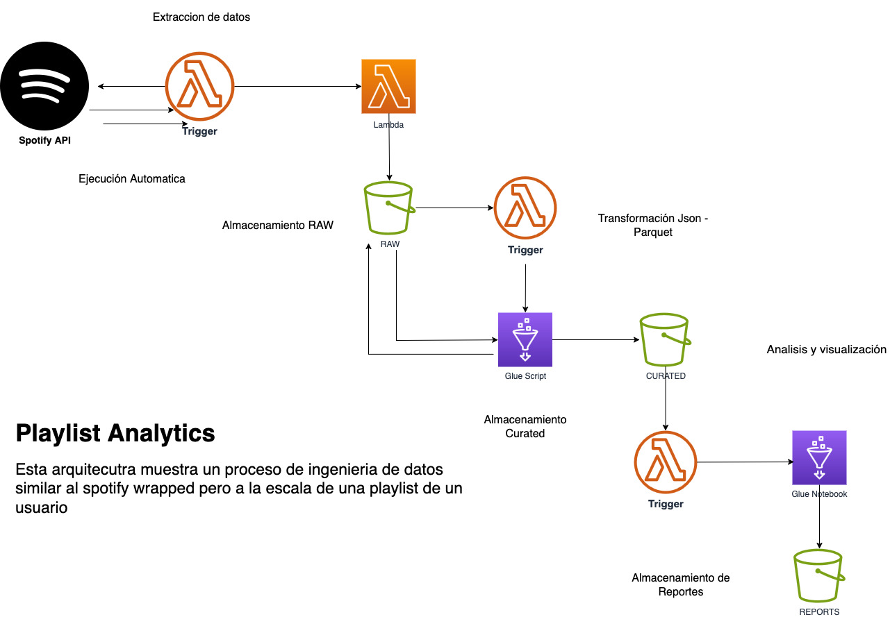

# AWS - Spotify-Playlist-Analytics

Esta arquitectura muestra un proceso de ingeniería de datos similar al **Spotify Wrapped**, pero a la escala de una playlist de un usuario.

## 📌 Arquitectura del Proyecto


---

## 🔹 Descripción del Proyecto
Este proyecto implementa un **pipeline de datos escalable** utilizando **AWS Glue** para extraer, transformar y analizar los datos de una **playlist de Spotify**.  

📌 **Flujo del Proyecto**:
1️⃣ **Extracción**: AWS Lambda obtiene todas las canciones de la playlist mediante la API de Spotify y las almacena en **Amazon S3** en formato JSON.  
2️⃣ **Transformación**: Un **AWS Glue Job** convierte los datos de **JSON a Parquet**, optimizando el almacenamiento y la consulta.  
3️⃣ **Análisis**: Un **Glue Notebook** carga los datos, genera indicadores clave (top de canciones, duración promedio, artistas más frecuentes) y visualiza los resultados con **Matplotlib**.  
4️⃣ **Escalabilidad**: El pipeline puede escalar desde **pequeñas cargas en AWS Glue** hasta **procesamiento masivo en AWS EMR** según la necesidad.  

---

## 🚀 Herramientas Utilizadas
| Tecnología | Descripción |
|------------|-------------|
| **AWS Lambda** | Función para extraer datos desde la API de Spotify y almacenarlos en S3. |
| **Amazon S3** | Almacenamiento de los archivos JSON crudos y los datos transformados en formato Parquet. |
| **AWS Glue** | Servicio ETL serverless utilizado para transformar datos de JSON a Parquet. |
| **AWS Glue Notebook** | Entorno interactivo para análisis de datos y generación de gráficos. |
| **Python** | Lenguaje principal para procesamiento y transformación de datos. |
| **Pandas** | Librería utilizada para manipulación de datos en Glue. |
| **Matplotlib** | Generación de visualizaciones de los datos procesados. |

---

## 🎵 **Datos Extraídos desde la API de Spotify**
La API de Spotify proporciona los siguientes datos sobre cada canción en una playlist:

| **Campo**              | **Descripción** |
|------------------------|----------------|
| `track.name`          | Nombre de la canción. |
| `track.artists[0].name` | Nombre del artista principal. |
| `track.duration_ms`    | Duración en milisegundos. |
| `added_at`            | Fecha y hora en la que se agregó la canción a la playlist. |
| `track.popularity`    | Nivel de popularidad de la canción (0-100). |
| `track.preview_url`   | URL para escuchar una vista previa de la canción. |

---

## 📊 **Indicadores Generados**
| **Indicador**                            | **Descripción** |
|------------------------------------------|----------------|
| **Total de Canciones**                   | Número total de canciones en la playlist. |
| **Top 10 Canciones Más Escuchadas**      | Canciones con mayor frecuencia en la playlist. |
| **Duración Promedio de Canciones**       | Tiempo promedio de duración de una canción. |
| **Top 10 Artistas Más Frecuentes**       | Artistas con más canciones en la playlist. |
| **Duración Total por Artista**           | Tiempo total de canciones por cada artista. |
| **Frecuencia de Canciones por Fecha**    | Cantidad de canciones agregadas en distintos días. |

---

## 🔐 **Obtener el Token de Autenticación de Spotify**
La API de Spotify requiere autenticación **OAuth 2.0**. El token solo es válido por **una hora (3600 segundos)**.

### **1️⃣ Crea una aplicación en el Developer Portal de Spotify**
   - Visita [Spotify Developer Dashboard](https://developer.spotify.com/dashboard/).
   - Obtén tu `CLIENT_ID` y `CLIENT_SECRET`.

### **2️⃣ Genera el Token con `curl`**
   Ejecuta el siguiente comando en la terminal:

   ```bash
   curl -X POST "https://accounts.spotify.com/api/token" \
   -H "Content-Type: application/x-www-form-urlencoded" \
   -d "grant_type=client_credentials" \
   -u CLIENT_ID:CLIENT_SECRET
